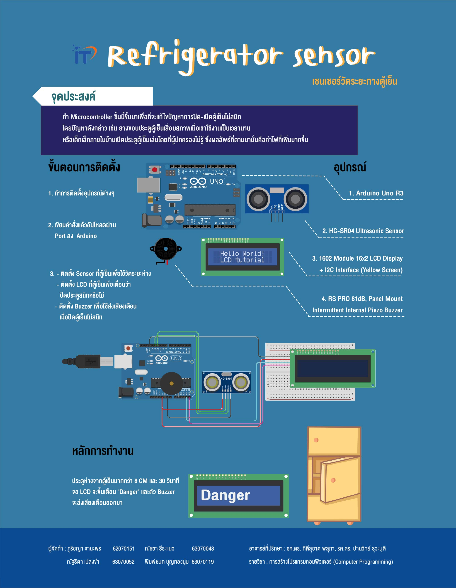

# Refrigerator sensor
> Computer Programming Project KMITL Semester 2/2020 1st Year
## ที่มา
> ในหลาย ๆ บ้านมักมีปัญหาการปิดประตูตู้เย็นไม่สนิท ดังนั้นจึงจัดทำ "Microcontroller" ในรูปแบบเซนเซอร์ชิ้นนี้ขึ้นมาเพื่อที่จะแก้ไขปัญหา โดยปัญหาดังกล่าวนั้นเช่น ยางของขอบประตูตู้เย็นเสื่อมสภาพทำให้เวลาปิดประตูตู้เย็นจะไม่สนิทเท่าที่ควร หรือใครหลายคนอาจจะลืมปิดประตูตู้เย็น ส่งผลเสียคือ ค่าไฟที่เพิ่มมากขึ้น
## วัตถุประสงค์
> ป้องกันการปิดตู้เย็นไม่สนิทโดยใช้ Microcontroller ส่งสัญญาณเตือนให้ผู้ใช้งานได้รู้
## ข้อดี
> * ประหยัดค่าไฟ
> * เตือนความจำ
> * ใช้งานง่าย เข้าถึงทุกครัวเรือน
> * ช่วยยืดอายุการใช้งานของตู้เย็น
## อุปกรณ์
> * Piezo Buzzer
> * Ultrasonic Distance Sensor
> * Ardino Uno R3
> * LCD
## เว็บไซต์
> * [Website](https://goofy-lalande-292e89.netlify.app/#home)
## วิดีโอนำเสนอ
> * [Youtube](https://www.youtube.com/watch?v=g0TveA3Xgcw)
## โปสเตอร์

> * [Poster (download)](https://github.com/Pimchanok119/Compro/raw/main/poster/poster.jpg)
>  
---
สมาชิก
---

| รหัสนักศึกษา | ชื่อ - นามสกุล |  หน้าที่ | Github |
| :-------- | :-------- | :--------- |:--------- |
|   62070151   |   ภูริชญา จานะพร   |    Website   |   [prcyyy](https://github.com/prcyyy)   |
|   63070048   |   ณัชชา ธีระแนว   |    Microcontroller / Poster   |  [nutcha20](https://github.com/nutcha20)   |
|   63070052   |   ณัฐธิดา เปล่งขำ   |    Microcontroller / Poster   |   [Nutthidapops_](https://github.com/63070052)   |
|   63070119   |   พิมพ์ชนก บุญทองนุ่ม   |    Website / VDO Present   |  [Pimchanok119](https://github.com/Pimchanok119)   |
